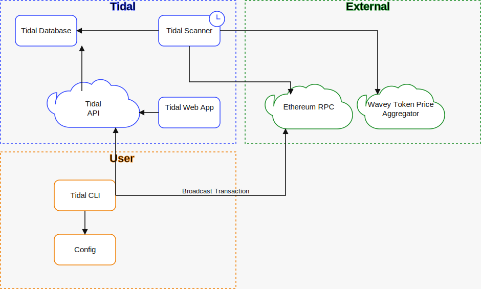

# Architecture

## Purpose

Tidal exists to answer two operational questions quickly and safely:

1. What auction actions are currently worth taking?
2. How can a CLI client prepare and broadcast those actions without giving the server custody of private keys?

The design splits shared state from signing authority. The server owns the database and background jobs. CLI clients keep keys local.

## Overview Diagram



## Main Components

| Component | Responsibility | Main code |
|---|---|---|
| Scanner | Builds the cached dataset: sources, balances, auctions, prices, logos, enabled tokens | `tidal/scanner/service.py` |
| Persistence | Shared SQLite schema, migrations, repository helpers | `tidal/persistence/`, `alembic/` |
| Transaction service | Selects candidates, inspects auctions, prepares actions, signs/broadcasts when running server-side flows | `tidal/transaction_service/` |
| API | Exposes read models and action preparation over HTTP | `tidal/api/app.py` |
| Read models | Dashboard rows, kick logs, scan logs, run details | `tidal/read/` |
| CLI client | API-backed inspection and action execution with local wallet signing | `tidal/cli.py` |
| Server operator CLI | Direct server-side entrypoint for migrations, scans, daemons, API, auth | `tidal/server_cli.py` |
| UI | Read-only monitoring plus CLI client action flows | `ui/src/App.jsx` |
| Contract | On-chain `AuctionKicker` helper used for atomic kick execution | `contracts/src/AuctionKicker.sol` |

## End-To-End Flow

```text
Yearn contracts / auctions / token APIs
                |
                v
           scanner service
                |
                v
             SQLite
                |
                +--> FastAPI control plane --> dashboard UI
                |
                +--> FastAPI control plane --> CLI client
                                              |
                                              v
                                       local wallet signing
                                              |
                                              v
                                           Ethereum
                                              |
                                              v
                                      broadcast/receipt audit
                                              |
                                              v
                                            SQLite
```

## Data Flow

### 1. Scanner

The scanner reads on-chain state and writes the current cache into SQLite.

It is responsible for:

- discovering Yearn strategies and their vault context
- loading configured fee burners
- resolving strategy and fee-burner token balances
- refreshing token USD prices and logos from `prices.wavey.info`
- mapping sources to auctions
- caching enabled-token status per auction
- optionally auto-settling stale auctions

### 2. Read Path

The UI and CLI client do not query SQLite directly. They read through the FastAPI control plane.

That gives one shared source of truth for:

- dashboard rows
- kick logs
- scan logs
- action audit history
- prepare-time logic

### 3. Action Preparation

For mutating workflows, the server prepares actions but does not hold the wallet.

The normal CLI client path is:

1. CLI calls the API to inspect or prepare an action.
2. API returns calldata, pricing context, and audit identifiers.
3. CLI signs locally using a Foundry keystore or explicit keystore file.
4. CLI broadcasts locally.
5. CLI reports broadcast and receipt details back to the API.

This keeps signing authority on the CLI client machine while the server remains the source of shared state and audit history.

## Kick Pipeline

The kick flow is intentionally split between cached ranking and just-in-time pricing.

### Cached phase

The shortlist is built from cached scanner outputs:

- cached source balances
- cached sell-token USD prices
- cached auction mappings
- cached enabled-token data

This phase is cheap and stable enough to rank opportunities.

### Just-in-time phase

When a specific candidate is prepared:

- live source balance is read again
- the final sell size is computed
- a live `/v1/quote` call is made for the exact candidate
- start and floor prices are derived from that live quote
- a just-in-time `/v1/price` call is made for the want token to power the confirmation warning

The key rule is that live quote data is used to price the transaction, not to rank the shortlist.

## Storage Model

SQLite is the canonical datastore. This repo configures SQLite with:

- WAL mode
- `busy_timeout`
- SQLAlchemy session management in `tidal/persistence/db.py`

The database stores:

- latest scanner snapshots
- token metadata and prices
- scan run history
- kick transaction history
- API action audit rows
- API keys

## Trust Boundaries

### Server

The server is trusted with:

- RPC access
- database ownership
- API key validation
- action preparation
- audit persistence

The server is not trusted with:

- CLI client private keys

### CLI Client

The CLI client is trusted with:

- local keystore access
- local transaction signing
- local broadcast

The CLI depends on the API for shared state and prepared payloads, but the signing step stays local.

## Useful Entry Points

- Scanner loop: `tidal/scanner/service.py`
- Kick shortlist: `tidal/transaction_service/evaluator.py`
- Kick prepare logic: `tidal/transaction_service/kicker.py`
- API app assembly: `tidal/api/app.py`
- CLI client HTTP client: `tidal/control_plane/client.py`
- Dashboard UI: `ui/src/App.jsx`
